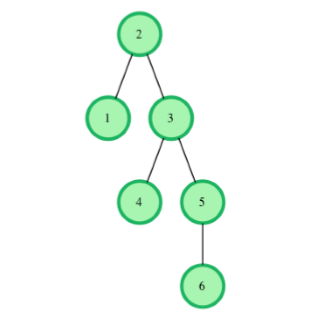
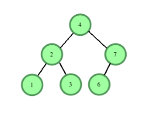

# Binary Search Tree :
# Lowest Common
# Ancestor

You are given pointer to the root of the binary search tree and two values and. You need to return
the lowest common ancestor (LCA) of and in the binary search tree.

In the diagram above, the lowest common ancestor of the nodes **4** and **6**is the node**3**. Node **3** is the
lowest node which has nodes **4** and **6** as descendants.

**Function Description**
Complete the function lca in the editor below. It should return a pointer to the lowest common ancestor
node of the two values given.
lca has the following parameters:

- root: a pointer to the root node of a binary search tree
- v1: a node.data value
- v2: a node.data value

**Input Format**
The first line contains an integer,_n_ , the number of nodes in the tree.
The second line contains _n_  space-separated integers representing _node.data_ values.
The third line contains two space-separated integers, ***v*1** and ***v*2**.
To use the test data, you will have to create the binary search tree yourself. Here on the platform, the
tree will be created for you.

**Constraints**
**1 <= _n,node.data <= 25**
**1 <= _v_1,_v_2 <= 25**
**_v_1 not equals _v_2** 
The tree will contain nodes with data equal to  ***v*1** and ***v*2** .

**Output Format**
Return the a pointer to the node that is the lowest common ancestor of ***v*1** and ***v*2** .

**Sample Input**

***v*1 = 1** and ***v*2 = 7** 

**Sample Output**
[reference to node 4]

**Explanation**
LCA of **1** and **7** is **4**, the root in this case.
Return a pointer to the node.

